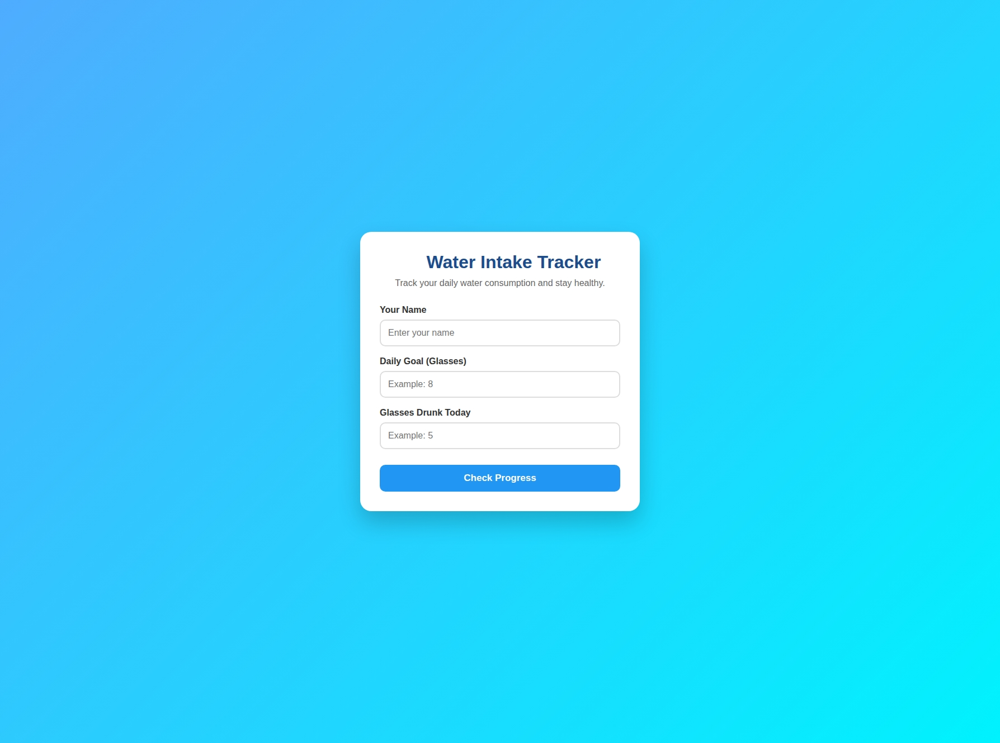
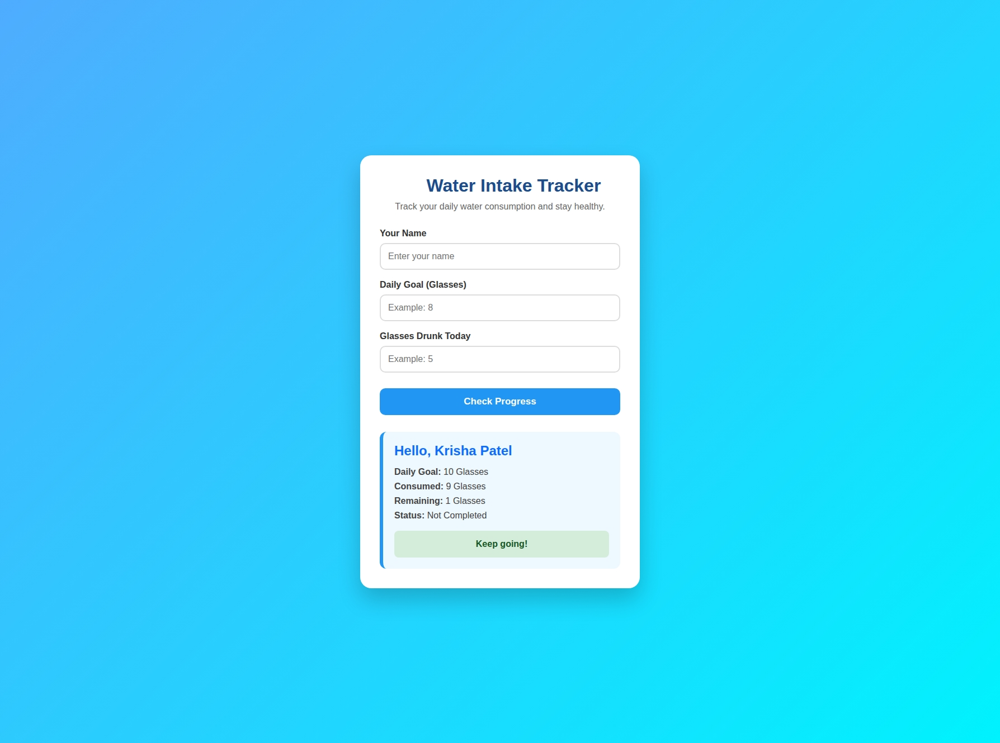

# 💧 Water Intake Tracker

| Home Page                     | Result Page                       |
| ----------------------------- | --------------------------------- |
|  |  |

## Overview

A simple Flask web application that helps users track their daily water intake. Users enter their name, daily water goal, and the number of glasses consumed to receive instant feedback on their progress.

## Features

* 💧 Track daily water intake
* 👤 Personalized results
* ⚡ Flask backend with form handling
* 🎨 Modern responsive UI
* 📱 Mobile-friendly design

## Tech Stack

* Python
* Flask
* HTML5
* CSS3
* Jinja2

## Project Structure

```text
water-intake-tracker/
│── app.py
│── requirements.txt
│── README.md
│
├── templates/
│   └── index.html
│
├── static/
│   └── style.css
│
└── screenshots/
    ├── home.png
    └── result.png
```